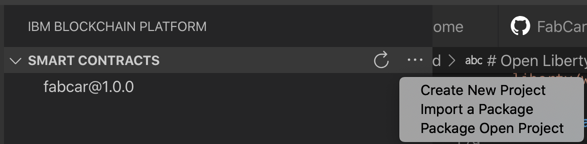

# Hyperledger Fabric Integration with an Open Liberty Client

>Hyperledger Fabric sample using Open Liberty to execute transactions with IBM Blockchain Platform

This tutorial introduces Open Liberty, a lightweight open source application server making REST requests to a blockchain network. You’ll discover exactly what `blockchain` is by implementing a `local fabric network` from scratch. All done by using the Blockchain and Open Liberty plugins all from VS code.

You’ll be able to execute different HTTP Methods for different transactions from the Open Liberty server, and the blockchain network will return a response to the web browser. Experiencing how easy it is to start up a Blockchain Network as well as see how fast Open Liberty starts up as an application server. Also seeing experiencing some of the cool features included in Open Liberty for free!

## Prerequisites:

* Java
* Git
* Maven
* Docker
* VS Code

## What is “Blockchain”?
Blockchain is a way of storing digital data. The data can literally be anything. For Bitcoin, it’s the transactions (logs of transfers of Bitcoin from one account to another), but it can even be files; it doesn’t matter. The data is stored in the form of blocks, which are linked (or chained) together using cryptographic hashes — hence the name “blockchain.”

In our instance, we are using cars, on our ledger we are going to make transactions to the ledger and add cars to the `blockchain`.

## What is "Open Liberty"?

Open Liberty is a lightweight open source java `application server`. It is a webserver to handle requests for dynamic content, such as servlets, from web applications. 

Liberty features include [Jakarta EE](http://jakarta.ee), [Java EE](https://oracle.com/java/technologies/java-ee-glance.html) and MicroProfile. Open Liberty is so lightweight you only have to run what you need. You can find out more [openliberty.io](https://openliberty.io/)

## Steps

* Get the Dev Tools

* Import Open Liberty project into VS code

* Import the sample Blockchain project into 'Smart Contracts'

* Start Blockchain Network

* Export Profiles

* Startup Open Liberty server

* Query all items on the ledger

* Query specific items on the ledger

* Add Cars to the ledger.

* Update the owner of a Car on the Ledger

* Optional - View Open Liberty Metrics

* Stop the Open Liberty server

* Stop the Blockchain Network

* Finished


## 1. Get the Development Tools

i. If you don't already, [Install Visual Studio Code.](https://code.visualstudio.com/download) 

### Install IBM Blockchain Platform VS Code Extension

ii. Go to the VS Code Marketplace and search for [IBM Blockchain](https://marketplace.visualstudio.com/items?itemName=IBMBlockchain.ibm-blockchain-platform)

iii. Install the IBM Blockchain Platform extension

iv. After installation, if any additional prerequisites are needed, the extension will guide you through installing them. Make sure you pick up the Docker prerequisites, as they'll be used to create your Fabric network

### Install Open Liberty VS Code Extension

i. Install the [Open Liberty Dev Dashboard plugin](https://marketplace.visualstudio.com/items?itemName=Open-Liberty.liberty-dev-vscode-ext)

## 2. Import the Open Liberty project into VS Code

i. Open up a terminal window and `clone` the sample project:

`git clone https://github.com/tomjenningss/Open-Liberty-Blockchain.git`

ii. Add the current project to VS Code:

`File -> Open` `Open-Liberty-Blockchain` and click `open`

This will add the project to the workspace and will automatically add `Liberty Dev Dashboard` into the VS Code extension.

## 3. Import Blockchain Sample project into 'Smart Contracts'

### Add Fabcar Sample project into VS Code and Package the 'Open Project'

i. Click on the IBP icon in the top right hand corner. (It may take a moment, in the purple bar at the bottom it will say activating extension) 


ii. Pick FabCar from the `explore sample code` section.

iii. Click the clone button to git clone the sample code for the FabCar sample. Choose a convenient location to clone the fabric sample. 

iv. Press `Clone repository.`


v.  From the list of options choose `FabCar v1.0.0 Java.`

Click on `Open Locally` and in the Command Palette click `Add to workspace`. 


vi. Optional: Press on the file explorer button in the top left 

You will see `fabcar-contract-java` this is the project to create the blockchain network.

vii. Navigate back to the IBM Blockchain Platform VS Code extension by clicking on the Blockchain logo on the left hand side. 

viii. Under `Smart Contracts` click on `...` 

ix. As the project is in your VS Code workspace, click on `Package Open Project`

 

x. You will be prompted to `Enter a name for your Java Package`

Call it `fabcar` and press `enter`

xi. Then you will be prompted to `Enter a version for your Java package`

Call it `1.0.0`

Well done, you have successfully imported and packaged `fabcar@1.0.0` into `SMART CONTRACTS`.

## 4. Startup the Blockchain Network

i. Under Fabric Environments press on `Local Fabric o (click to start)` 

This will start up docker containers and configure startup the blockchain network. The first time take 3-5 minutes, as it pulls down the Docker images starts the containers up and configures the Blockchain network.

ii. Install Fabcar into the Environments Smart contract

Under `Smart Contracts` > `Installed`, click `+Install`

Choose `fabcar-contract-java Open Project`

iii. Under `Smart Contracts` > Instantiated, click `+Instantiate`

Choose `fabcar@1.0.0`

iv. For this tutorial, no optional features are needed

`Optional functions` will appear, press `enter` to skip

v. As well, you don't need any private data configuration files

`Do you want to provide a private data collection configuration file`

Select `no`

In the notification window at the bottom left it will say `IBM Blockchain Platform Extension: Instantiating Smart Contract`

This will take approximatly 2-5 minutes to instantiate the smart contract. 


## 5. Export Profiles

For Open Liberty to communicate to the Blockchain Network, Hyperledger Fabric has security features, which stop applications attempting to make transactions unless you have the specific Profiles and certificate authorities.

i. Export the `Local Fabric Gateways` 

Hover over `FABRIC GATEWAYS` heading and click on `...` and `Export connection profile `


The `finder` window will open and navigate to 

`Users/Shared/`

>Create new folder `FabConnection`

Full path directory `Users/Shared/FabConnection`

Save the `.json` file as `1-Org-Local-Fabric-Org1_connection.json`

ii. Export the `Fabric Wallets` 

Click on `1 Org Local Fabric - Org1 Wallet` and right click Export Wallet. 


iii. Save the folder as `wallet` in `/Users/Shared/FabConnection/` directory.

## 6. Start up the Open Liberty Server

i. As we installed the `Dev Tool` for Open Liberty click on the `Liberty Dev Dashboard` icon and the extension will display the project.  `ol-blockchain` 

ii. Right click on `OL-blockchain` and hit `Start`. This will start the application server up very quickly. Usually within 2 - 5 seconds!

 

The server will usually start approximatly in 4-12 seconds.

 

## 7. Query what is already on the ledger:

One of the features we are showing off is MicroProfile Open API. You will be able to execute HTTP Methods such as POST, GET and PUT. You will use all three in the example.

Open up a web-browser such as Chrome, and go to:

`http://localhost:9080/openapi/ui/` 

This will display all the possible operations you can do to the blockchain network. 

The OpenAPI feature shows off which HTTP response is being showcased. Quering all cars on the ledger is a `GET` request. 


If you are keen you can see the output on the terminal window in VS Code, where its the same output. This is useful to see if it hasn't worked you can see the `stack trace` with an error on why it hasnt worked.

Navigate to `GET /System​/Resources​/Cars Returns all cars`, 

`Try it out` 

It will send a request to the Ledger and return back all cars.

Successful response should look like:

```json
Queried all Cars Successfully.
Cars:
[{"Key":"CAR0","Record":{"make":"Toyota","model":"Prius","colour":"blue","owner":"Tomoko"}}]
```

## 8. Query specific car on the ledger:

As you can see, there is an ID for each item on the Ledger. This is very useful if you want to query specific items on the ledger. To Query specific cars on the ledger. 

On the OpenAPI UI try out 

`GET /System​/Resources​/Car Returns an individual car by key`


```json
Queried car Successfully. 
Key = CAR5
Details = {"make":"Peugeot","model":"205","colour":"purple","owner":"Michel"}
```
You can Query any car on the ledger by changing the ID

## 9. Add a car to the ledger:

Navigate to 

`POST /System​/Resources​/Car Add a car to the ledger`

 click on `Try it out`. 

Fill in the `example schema` in with values. 


## 10. Update owner of Car in Ledger:

Navigate to 

`PUT /System​/Resources​/Car Update owner of a car in the ledger`

 click on `Try it out`. 

Fill in the `example schema` in with values. 


## 11. Optional - View Open Liberty Metrics

You can monitor metrics to determine the performance of a service.

A useful additional MicroProfile feature that is implemented is to view the metrics for the time it takes to execute a transaction. 

i. Navigate to `https://localhost:9443/metrics/application` 

ii. Authentication to view the metrics is required when prompted the `username` and `password` is:

Username: `admin`

password: `adminpwd`

Within the code the `@Timed` annotation is implemented so that when a transaction is executed a timer starts. 

ii. This is useful to see as you can see how fast it takes to `QueryAllCars` and retrieve the cars from the blockchain network.

   

The list tells you a summary for example: `application_QueryCarsProcessingTime_seconds_count{method="GET"} 2` means that the `GET` method has been called twice and the time it takes in `seconds` to execute the transaction is below it.

You can view the other ones under the summary sections with the metrics under the `# Help` summarys:
For example:

`# HELP application_UpdateCarProcessingTime_seconds Time needed to update car in the inventory`


## 12. Stop the Open Liberty Server

Once you have finished, go back to VS Code, Liberty Dev Dashboard, and press `Stop`. This will stop the Open Liberty Server. Now the server is not on, the application is not running anymore, meaning if you tried to go hit one of the end points, it wouldn't find it.

## 13. Tear down the Blockchain Network

To stop the blockchain network, click on the Blockchain Icon on the left hand side. On Fabric environments click on `...` and click `stop fabric environment` this will stop the environment from running. 

To remove the Docker images where it was running, on Fabric Environments click on `...` and choose `Teardown Fabric Environment`.

## Finished

You have experienced using two IBM Open Source contributed products. You have learnt what Blockchain is, an application server is and experienced making transactions to a ledger and adding to a ledger. 

<br>
<br>

 


