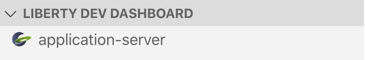

# Open Liberty Blockchain Client

This tutorial introduces Open Liberty, a light weight open source application server making REST requests to a blockchain network. You’ll discover exactly what a blockchain is by implementing a local blockchain network from scratch using the VS Code Blockchain extension, as well as starting the Open Liberty server all from VS code.

You’ll be able to hit endpoints for different functions from the Open Liberty server, and the blockchain network will return a response to the web browser. Experiencing how easy it is to start up a Blockchain Network as well as see how fast Open Liberty starts up as an application server and see some of the features included in Open Liberty for free!

## Prerequisites:

* Java
* Git
* Maven
* Docker
* VS Code

## What is “Blockchain”?
Blockchain is a way of storing digital data. The data can literally be anything. For Bitcoin, it’s the transactions (logs of transfers of Bitcoin from one account to another), but it can even be files; it doesn’t matter. The data is stored in the form of blocks, which are linked (or chained) together using cryptographic hashes — hence the name “blockchain.”

In our instance, we are using cars, and on our ledger we are going to make transactions to the ledger in the form of cars.

## What is "Open Liberty"?

Open Liberty is a Java application server. Put it simply, it hosts Java applications which you can access on a web browser. This is lightweight, free and allows you to make your own Java applications that you want to put on the web. The benefit of Open Liberty is you can have as much or as little as you want in terms of additional features on your web server. In terms of popularity its predecessor WebSphere Application Server, 20071 companies use it according to [enlyfit.](https://enlyft.com/tech/products/ibm-websphere-application-server)

## Steps

* [Get the Dev Tools](#1.-Get-the-Dev-Tools)

* [Add local fabric environment and start up Blockchain](#2.-Add-local-fabric-environment-and-start-up-Blockchain)

* [Get the Fabcar sample smart contract](#2.-Get-the-Fabcar-sample-smart-contract)

* [Deploy the smart contract onto the network](#3.-Get-the-Fabcar-sample-smart-contract)

* [Export Profiles](#5.Export-Profiles)

* [Start up Open Liberty server](#6.-Start-up-the-Open-Liberty-Server)

* [Query all items from the ledger](#7.-Query-what-is-already-on-the-ledger:)

* [Query specific items from the ledger](#8.-Query-specific-car-on-the-ledger:)

* [Add Cars to the ledger.](#9.-Add-a-car-to-the-ledger:)

* [10 Update owner of Car in Ledger](#10.-Update-owner-of-Car-in-Ledger)

* [Stop the Open Liberty server](#11.-Stop-the-Open-Liberty-Server)

* [Stop the Blockchain Network](#12.-Stop-and-tear-down-the-Blockchain-Network)

* [Finished](#Finished)


## 1. Get the Dev Tools

### Blockchain Dev Tool
1. If you dont already, [Install Visual Studio Code.](https://code.visualstudio.com/download) 
2. Go to the extensions Marketplace and search for [IBM Blockchain](https://marketplace.visualstudio.com/items?itemName=IBMBlockchain.ibm-blockchain-platform)
3. Install the IBM Blockchain Platform extension
4. After installation, if you need any additional pre-reqs, the extension will guide you through installing them. Make sure you pick up the Docker pre-reqs, as they'll be used to create your Fabric network

### Open Liberty Dev Tool

1. Go to the extensions Marketplace on VS code and search for "Open Liberty Dev Dashboard"
2. Install the [Open Liberty Dev Dashboard plugin](https://marketplace.visualstudio.com/items?itemName=Open-Liberty.liberty-dev-vscode-ext)

## 2. Add local fabric environment and start up Blockchain

1. Go to the "IBM Blockchain Platform" view in VS Code by clicking the IBP icon
2. Hover over the "Fabric Environments" section title and click the + icon
3. Choose "Add a new local network (from template)"
4. Choose the 2 Org template
5. Wait for your network to spin up!

## 3. Get the Fabcar sample smart contract

1. Make your way back to the IBM Blockchain Platform homepage on VS Code. This can be done by clicking the IBP icon 


2. Pick FabCar from the `explore sample code` section.

3. Click the clone button to git clone the sample code for the FabCar sample


4. You can pick whichever language you prefer to open the smart contract in however, because Open Liberty is a Java application server choose Java


This is a pre-configured smart contract already for you. Clone the Github repository for the `Java` `Fabcar` smart contract sample

## 4. Deploy the smart contract onto the network

1. Connect to the Fabric Environment you created earlier
2. Under Smart Contracts > Instantiated, click `+Instantiate`
3. Choose the folder you cloned from GitHub
4. If asked which peers to install on, pick them all
5. Accept the defaults on any other prompts (most things can be left blank and just hit Enter for a simple deployment like this)


## 5. Export Profiles

For Open Liberty to communicate to the Blockchain Network, Hyperledger Fabric has security features, which stop applications attempting to make transactions unless you have the specific Profiles.

Export the `Local Fabric Gateways` to do this right click on `1 org local fabric - org 1` and export and click Export connection profile. The `finder` window will open and save the `json` file as `1-Org-Local-Fabric-Org1_connection.json` in the `target/liberty/wlp/usr/servers/defaultServer` directory.

Export the `Fabric Wallets` by clicking on the `1 Org Local Fabric - Orderer Wallet` and right clicking the Export Wallet. Save the folder as `wallet` in the `target/liberty/wlp/usr/servers/defaultServer` directory.

## 6. Start up the Open Liberty Server

As we installed the `Dev Tool` for Open Liberty click on the `Liberty Dev Dashboard` icon and the extension will display the project. As the `artifact-Id` specified in the `pom.xml` where our server retrieves the dependincies for the server to run, it is called `ol-blockchainv` 



Right click on `application-server` and hit `Start`. This will start the application server up very quickly. Usually within 2 - 5 seconds!


The server has started in `Development mode` meaning it will show the command line and if you hit `enter` it will run tests onto the Server on demand.


## 7. Query what is already on the ledger:

Open Liberty uses Microprofile and one of the features we are showing off is MicroProfile Open API. Providing a GUI and buttons, means there is no need for the command line anymore to execute HTTP Methods such as POST, GET and PUT! In the example you will use all three.

Open up a web-browser such as Chrome, and go to:

`http://localhost:9080/openapi/ui/` 

This will display all the possible operations you can do to the blockchain network. 

The OpenAPI feature shows off which HTTP response is being showcased. Quering all cars on the ledger is a `GET` request. 


If you are keen you can see the output on the terminal window in VS Code, where its the same output. This is useful to see if it hasn't worked you can see the `stack trace` with an error on why it hasnt worked.

Navigate to `GET /System​/Resources​/Cars Returns all cars`, 

`Try it out` 

It will send a request to the Ledger and return back all cars.

Successful response should look like:

```json
Queried all Cars Successfully.
Cars:
[{"Key":"CAR0","Record":{"make":"Toyota","model":"Prius","colour":"blue","owner":"Tomoko"}}]
```

## 8. Query specific car on the ledger:

As you can see, there is an ID for each item on the Ledger. This is very useful if you want to query specific items on the ledger. To Query specific cars on the ledger. 

On the OpenAPI UI try out 

`GET /System​/Resources​/Car Returns an individual car by key`


```json
Queried car Successfully. 
Key = CAR5
Details = {"make":"Peugeot","model":"205","colour":"purple","owner":"Michel"}
```
You can Query any car on the ledger by changing the ID

## 9. Add a car to the ledger:

Navigate to 

`POST /System​/Resources​/Car Add a car to the ledger`

 click on `Try it out`. 

Fill in the `example schema` in with values. 


## 10. Update owner of Car in Ledger:

Navigate to 

`PUT /System​/Resources​/Car Update owner of a car in the ledger`

 click on `Try it out`. 

Fill in the `example schema` in with values. 


## 11. Stop the Open Liberty Server

Once you have finished, go back to VS Code, Liberty Dev Dashboard, and press `Stop`. This will stop the Open Liberty Server. Now the server is not on, the application is not running anymore, meaning if you tried to go hit one of the end points, it wouldn't find it.

## 12. Stop and Tear down the Blockchain Network

To stop the blockchain network, click on the Blockchain Icon on the left hand side. On Fabric environments click on `...` and click `stop fabric environment` this will stop the environment from running. 

To remove the Docker images where it was running, on Fabric Environments click on `...` and choose `Teardown Fabric Environment`.

## Finished

You have experienced using two IBM Open Source contributed products. You have learnt what Blockchain is, an application server is and experienced making transactions to a ledger and adding to a ledger. 

<br>
<br>

 


