# Integrating Java microservices with Blockchain using Hyperledger Fabric and Open Liberty

>Hyperledger Fabric sample using Open Liberty to execute transactions with IBM Blockchain Platform

In this tutorial, you will learn to:
* Install IBM's VS Code extension for Liberty and blockchain development
* Use the IBM Blockchain Platform extension to create a local blockchain network and deploy a sample smart contract (based on cars)
* Use the [Open Liberty](https://openliberty.io) extension to start a web server that can communicate with your blockchain network
* Transact on the blockchain network from the web server via REST APIs

This tutorial shows how a blockchain network can be used to store data, whilst a client application sitting outside the blockchain network interacts with the data, querying and updating it. This is a common pattern in most blockchain projects, and Open Liberty makes it easy to achieve.

You will be able to execute different HTTP Methods for various transactions from the Open Liberty server, and the blockchain network will return a response to the web browser. As a result, you will experience how easy IBM's developer tools make it to start up a blockchain network, as well as how promptly Open Liberty starts up as an application server. All while experiencing some of the great features included free within Open Liberty.

## Prerequisites:

* Java
* Git
* Maven
* Docker
* VS Code

## What is “Blockchain”?

Blockchain is a technology used to achieve a shared, immutable ledger between multiple parties. Some types of blockchain are open to anyone (e.g. Ethereum main-net or Bitcoin), but many blockchain use cases require a network with access restricted to known entities.

When multiple companies would benefit from having the exact same data, but it's _not_ appropriate to agree that one of them owns a single master-copy, a permissioned blockchain like Hyperledger Fabric is a good solution. IBM Blockchain Platform developer tools and other offerings use Hyperledger Fabric as the underlying blockchain technology.

In this example, a simple sample `network` and `smart contract` will be used: 
* The example network only has a single member and will run on your laptop: in a real scenario there would be multiple members, and you would use a service like [IBM Blockchain Platform](https://www.ibm.com/uk-en/cloud/blockchain-platform) to run the network in containers or on a cloud platform.
* The example smart contract is based on recording basic information about cars to a ledger.

## What is "Open Liberty"?

Open Liberty is a lightweight open source cloud-native Java runtime. It is a webserver to handle requests for dynamic content, such as servlets, from web applications. 

Liberty features include [Jakarta EE](http://jakarta.ee), [Java EE](https://oracle.com/java/technologies/java-ee-glance.html) and MicroProfile. Open Liberty is so lightweight you only have to run what you need. You can find out more [openliberty.io](https://openliberty.io/)

## Steps

1. Get the Development Tools
2. Import the Open Liberty project into VS Code
3. Import the "fabcar" sample smart contract project into VS Code
* Import the sample Blockchain project into 'Smart Contracts'

* Start Blockchain Network

* Export Profiles

* Startup Open Liberty server

* Query all items on the ledger

* Query specific items on the ledger

* Add Cars to the ledger.

* Update the owner of a Car on the Ledger

* Optional - View Open Liberty Metrics

* Stop the Open Liberty server

* Stop the Blockchain Network

* Finished


## 1. Get the Development Tools

i. If you have not already, [Install Visual Studio Code.](https://code.visualstudio.com/download) 

### Install IBM Blockchain Platform VS Code Extension

ii. Go to the VS Code Marketplace and search for [IBM Blockchain](https://marketplace.visualstudio.com/items?itemName=IBMBlockchain.ibm-blockchain-platform)

iii. Install the IBM Blockchain Platform extension

iv. After installation, if any additional prerequisites are needed, the extension will guide you through installing them. Make sure you pick up the Docker prerequisites, as they will be used to create your Fabric network

### Install Open Liberty VS Code Extension

i. Install the [Open Liberty Dev Dashboard plugin](https://marketplace.visualstudio.com/items?itemName=Open-Liberty.liberty-dev-vscode-ext)

## 2. Import the Open Liberty project into VS Code

i. Open up a terminal window and `clone` the sample project:

`git clone https://github.com/tomjenningss/Open-Liberty-Blockchain.git`

ii. Add the current project to VS Code:

`File -> Open` `Open-Liberty-Blockchain` and click `open`

This will add the project to the workspace and will automatically add `Liberty Dev Dashboard` into the VS Code extension.

## 3. Import the "fabcar" sample smart contract project into VS Code

### Add Fabcar Sample project into VS Code and Package the 'Open Project'

i. Click on the IBP icon in the top right-hand corner (it may take a moment, and in the purple bar at the bottom it will say activating extension).

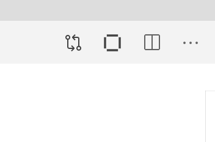

ii. Pick FabCar from the `explore sample code` section.

iii. Click the clone button to git clone the sample code for the FabCar sample. Choose a convenient location to clone the fabric sample. 

iv. Press `Clone repository.`

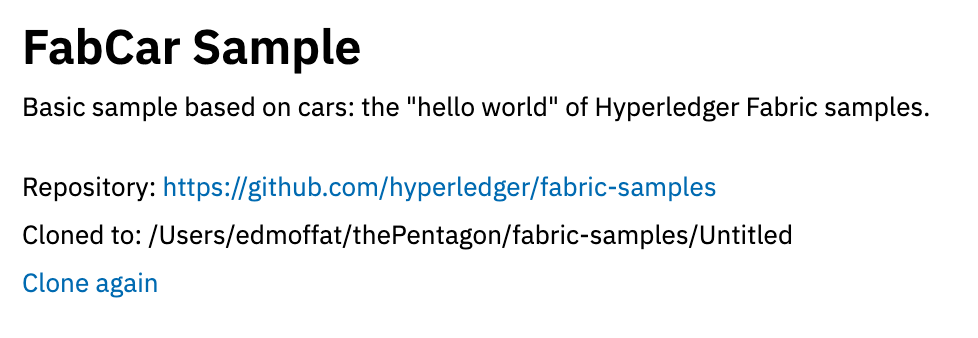

v.  From the list of options choose `FabCar v1.0.0 Java.`

Click on `Open Locally` and in the Command Palette click `Add to workspace`. 

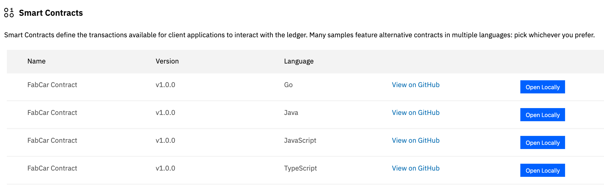

vi. Optional: Press on the file explorer button in the top left. 

You will see `fabcar-contract-java` this is the project to create the blockchain network.

vii. Navigate back to the IBM Blockchain Platform VS Code extension by clicking on the Blockchain logo on the left hand side, ready for the next part of the tutorial.


## 4. Startup the Blockchain Network

i. Under `FABRIC ENVIRONMENTS` press on `1 Org Local Fabric o (click to start)`.
   
   This will start up docker containers and configure the startup of the blockchain network. The first time will take approximately 3-5 minutes, as it pulls down the Docker images, starts the containers up and configures the Blockchain network.

ii. Once you're connected to the "Local Fabric" environment (this happens automatically after it has started), under `Smart Contracts` > `Instantiated`, click `+Instantiate`

   Choose `fabcar-contract-java Open Project` (at the command-palette prompt)

iii. You will be prompted to `Enter a name for your Java Package.`

   Call it `fabcar` and press `enter`

iv. Then you will be prompted to `Enter a version for your Java package`

   Call it `1.0.0`

v. For this tutorial, no optional features are needed.

   `Optional functions` will appear, press `enter` to skip.

vi. Also, you don't need any private data configuration files

   When asked `Do you want to provide a private data collection configuration file`, select `no`

In the notification window at the bottom left it will say `IBM Blockchain Platform Extension: Instantiating Smart Contract`

This will take approximately 2-5 minutes to instantiate the smart contract. 


## 5. Export Profiles

For Open Liberty to communicate to the Blockchain Network, Hyperledger Fabric has security features, which stop applications attempting to make transactions unless you have the specific profiles and certificate authorities.

i. Export the `Local Fabric Gateways` 

In the `FABRIC GATEWAYS` panel, make sure you're connected to the gateway for the environment (`1 Org Local Fabric - Org1`), then hover over the `FABRIC GATEWAYS` heading, click on `...` and `Export connection profile `

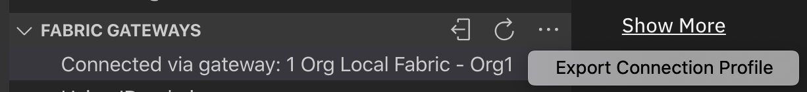

The `finder` window will open and navigate to:

`Users/Shared/`

>Create new folder `FabConnection`

Full path directory `Users/Shared/FabConnection`

Save the `.json` file as `1-Org-Local-Fabric-Org1_connection.json`

ii. Export the `Fabric Wallets` 

In the `FABRIC WALLETS` panel, click on `1 Org Local Fabric - Org1 Wallet` and right click Export Wallet. 

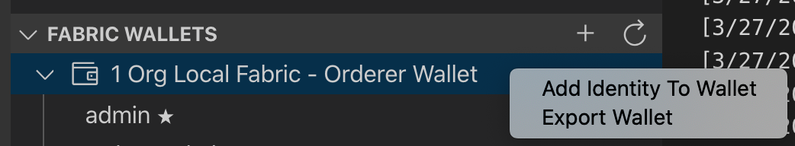

iii. Save the folder as `wallet` in `/Users/Shared/FabConnection/` directory.

## 6. Start up the Open Liberty Server

i. As we installed the `Dev Tool` for Open Liberty click on the `Liberty Dev Dashboard` icon and the extension will display the project.  `ol-blockchain` 

ii. Right click on `OL-blockchain` and hit `Start`. 

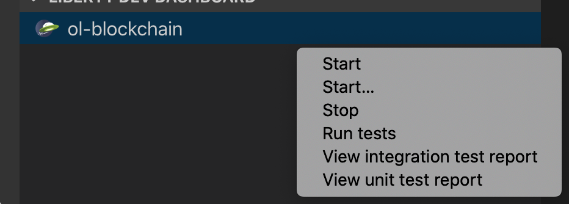 

This will start the application server up very quickly. Usually within 2 - 5 seconds.

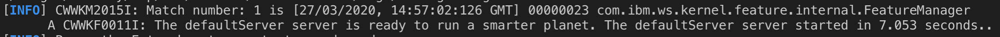 

## 7. Query what is already on the ledger:

One of the features we are showing off is MicroProfile Open API. You will be able to execute HTTP Methods such as POST, GET and PUT. You will use all three in the example.

i. Open up a web-browser such as Chrome, and go to:

`http://localhost:9080/openapi/ui/` 

This will display all the possible operations you can do to the blockchain network. 

The OpenAPI feature shows off which HTTP response is being showcased. Querying all cars on the ledger is a `GET` request. 

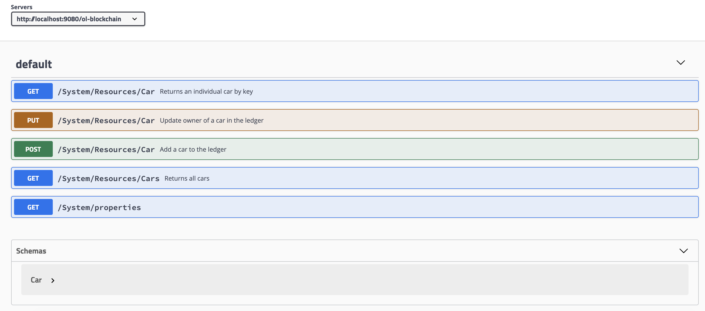


If you are keen, you can see the output on the terminal window in VS Code, where it's the same output. This is useful to see if it has not worked, as you can see the `stack trace` error. 

ii. Navigate to `GET /System/Resources/Cars Returns all cars`, 

`Try it out` 

It will send a request to the Ledger and return back all cars.

A successful response should look like:

```json
Queried all Cars Successfully.
Cars:
[{"Key":"CAR0","Record":{"make":"Toyota","model":"Prius","colour":"blue","owner":"Tomoko"}}]
```

## 8. Query specific car on the ledger:

As you can see, there is an ID for each item on the ledger. This is very useful if you want to query specific items on the ledger. To query specific cars on the ledger: 

i. On the OpenAPI UI try out 

`GET /System/Resources/Car Returns an individual car by key`

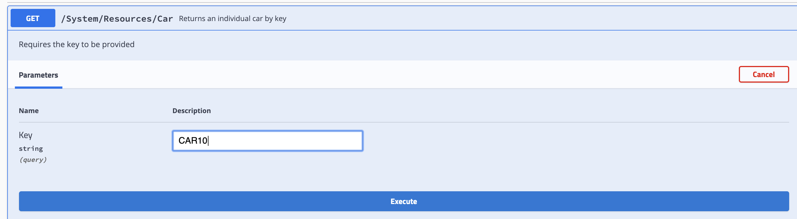


```json
Queried car Successfully. 
Key = CAR5
Details = {"make":"Peugeot","model":"205","colour":"purple","owner":"Michel"}
```
You can Query any car on the ledger by changing the ID

## 9. Add a car to the ledger:

Navigate to 

`POST /System/Resources/Car Add a car to the ledger`

i. Click on `Try it out`. 

Fill in the `example schema` in with values. 

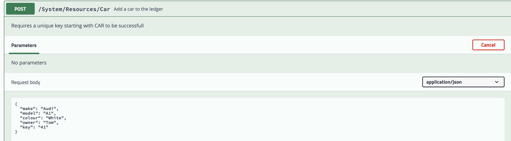

## 10. Update owner of Car in Ledger:

i. Navigate to:

`PUT /System​/Resources​/Car Update owner of a car in the ledger`

 Click on `Try it out`. 

Fill in the `example schema` in with values. 

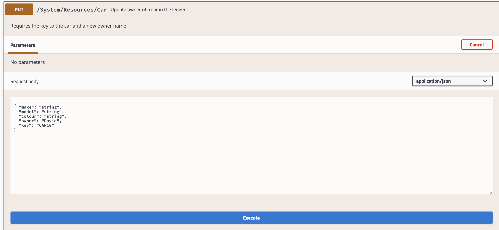

## 11. Optional - View Open Liberty Metrics

You can monitor metrics to determine the performance of a service.

A useful, additional MicroProfile feature implemented is to view the metrics for the time it takes to execute a transaction. 

i. Navigate to `https://localhost:9443/metrics/application` 

ii. Authentication to view the metrics is required when prompted the `username` and `password` is:

username: `admin`

password: `adminpwd`

Within the code the `@Timed` annotation is implemented so that when a transaction is executed, a timer starts. 

ii. This is useful to see as you can see how fast it takes to `QueryAllCars` and retrieve the cars from the blockchain network.

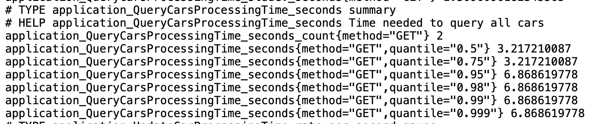   

The list tells you a summary for example: `application_QueryCarsProcessingTime_seconds_count{method="GET"} 2` means that the `GET` method has been called twice and the time it takes in `seconds` to execute the transaction is below it.

You can view the other ones under the summary sections with the metrics under the `# Help` summaries:
For example:

`# HELP application_UpdateCarProcessingTime_seconds Time needed to update car in the inventory`


## 12. Stop the Open Liberty Server

Once you have finished, go back to VS Code, Liberty Dev Dashboard, and press `Stop`. This will stop the Open Liberty Server. Now the server is off, the application is not running anymore, meaning if you tried to hit one of the endpoints, it would not find it.


## 13. Tear down the Blockchain Network

To stop the blockchain network, click on the Blockchain Icon on the left-hand side. On Fabric environments click on `...` and click `stop fabric environment`.

To remove the Docker images where it was running, on Fabric Environments click on `...` and choose `Teardown Fabric Environment`.

## Finished

You have experienced using two IBM Open Source contributed products. You have learnt what Blockchain is, what an application server is, and have experienced making transactions to a ledger, and adding to a ledger.

<br>
<br>

 
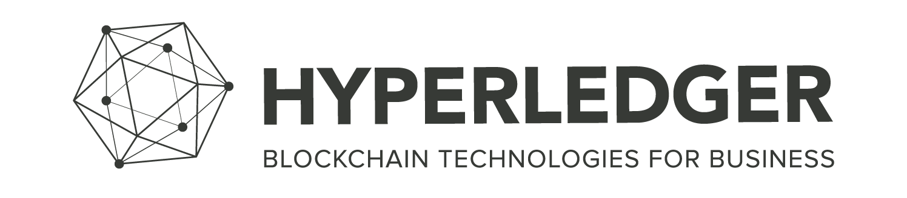

